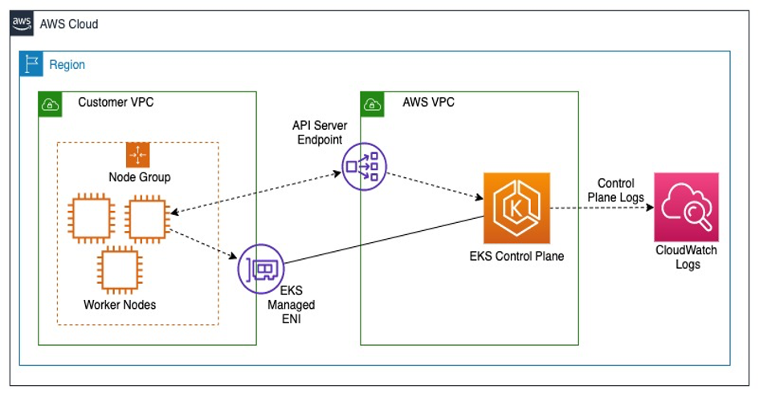
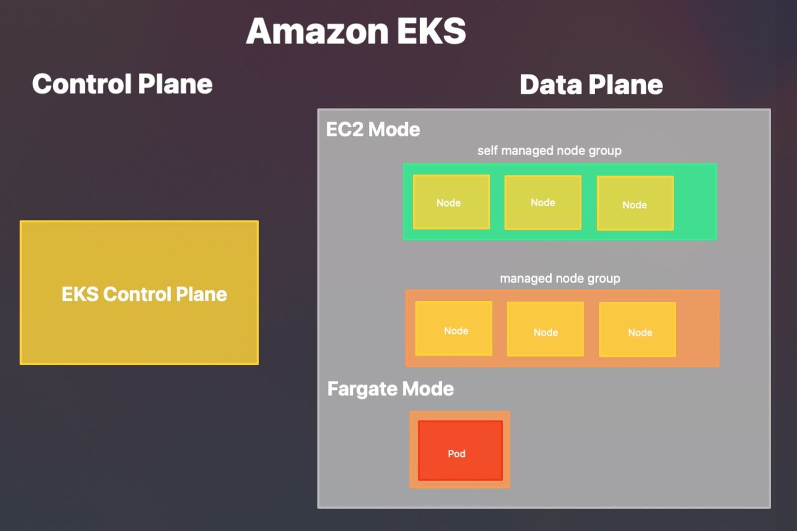

# What is Amazon Elastic Kubernetes Service 
Amazon Elastic Kubernetes Service (Amazon EKS) is a managed service that you can use to run Kubernetes on AWS without needing to install, operate, and maintain your own Kubernetes control plane or nodes. Kubernetes is an open-source system for automating the deployment, scaling, and management of containerized applications. 

## EKS Compute

1. [Self Managed Node Groups](https://docs.aws.amazon.com/zh_tw/eks/latest/userguide/worker.html)
2. [Managed Node Groups](https://docs.aws.amazon.com/zh_tw/eks/latest/userguide/managed-node-groups.html)
3. [Fargate](https://docs.aws.amazon.com/zh_tw/eks/latest/userguide/fargate.html)

Ref:
1. https://docs.aws.amazon.com/zh_tw/eks/latest/userguide/what-is-eks.html
2. https://docs.aws.amazon.com/zh_tw/eks/latest/userguide/eks-compute.html
3. https://aws.amazon.com/tw/eks/features/
4. https://youtu.be/E956xeOt050
5. https://aws.amazon.com/blogs/containers/understanding-and-cost-optimizing-amazon-eks-control-plane-logs/

[Back to README.md](./README.md)