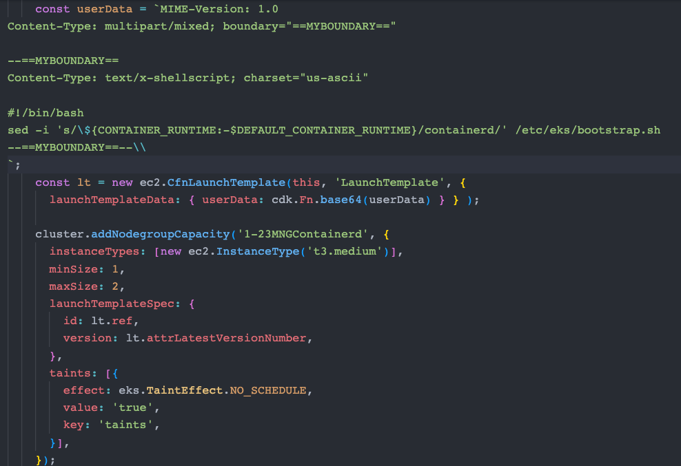
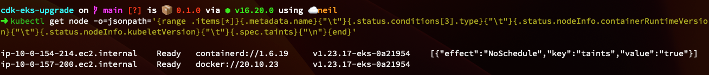
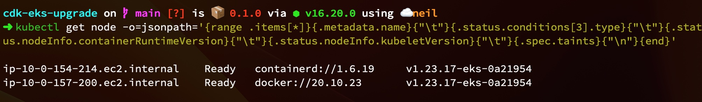
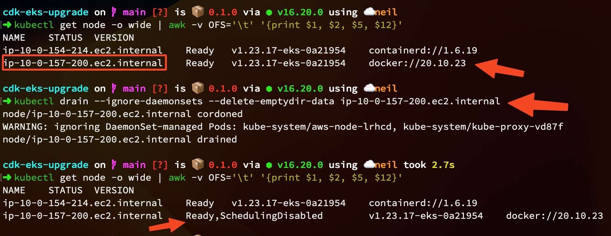
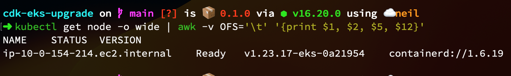
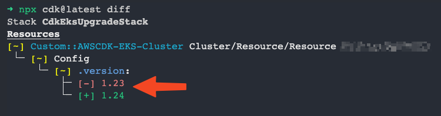
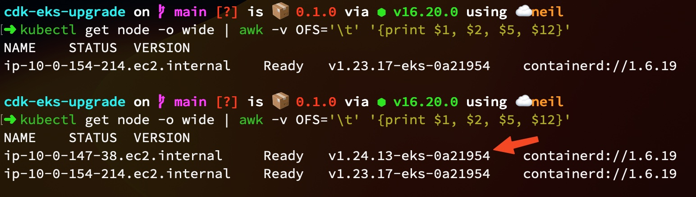
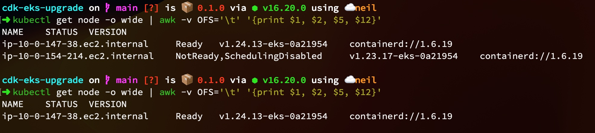

### What is [EKS](./AMAZON_EKS.md)?
# EKS 1.23 supported by Amazon EKS until October 11, 2023.
## This is sample repo supported by Amazon EKS until October 11, 2023.
> 此專案用來示範，當 EKS 1.23 叢集，升到 EKS 1.24 時，可以試試看的方式。
> 🚨 免責聲明：該範例只用來示範分享經驗，沒有受到任何 Amazon or Kubernetes Community 的背書，請勿視為官方的手冊，所有所失不負任何擔保責任。🚨 


> 前提提要： [Kubernetes is deprecating Docker as a container runtime after v1.20](https://kubernetes.io/blog/2020/12/02/dont-panic-kubernetes-and-docker/).
> [Is Your Cluster Ready for v1.24?](https://kubernetes.io/blog/2022/03/31/ready-for-dockershim-removal/)
> [Container Runtimes](https://kubernetes.io/docs/setup/production-environment/container-runtimes/)

---

## 升級 Managed Node Group 的邏輯（我的邏輯）
- 因此當 v1.23 Cluster 要升級成，v1.24 之前，會建議先把當前還在使用的 docker-shim 作為 CNI 的

1. 創建另一組 `v1.23` 新的 `Managed Node Group` 將會使用 containerd 作為 CNI，並給予 [taint](https://kubernetes.io/zh-cn/docs/concepts/scheduling-eviction/taint-and-toleration/)，這邊會在 [CDK 內宣告](https://docs.aws.amazon.com/cdk/api/v2/docs/aws-cdk-lib.aws_eks-readme.html#managed-node-groups)， (cdk deploy)。[🚨🚨🚨 如果當前 Managed Node Group 還是用 docker-shim 才要做 🚨🚨🚨]
    > 如果是使用 amazon-eks-ami 作為 managed node group 的 ami，在 [bootstrap.sh](https://github.com/awslabs/amazon-eks-ami/blob/91c6002ff1b3b11e59941aad7417dc91dcf665ef/files/bootstrap.sh#L196) 中有定義， `"$KUBELET_VERSION" gteq "1.24.0"`，the way to hack bootstrap.sh in amazon-eks-ami.
    



---

2. 測試部署自己的 Applications，到新的 `Managed Node Group`上，在部署時可以宣告 [tolerations](https://kubernetes.io/docs/concepts/scheduling-eviction/taint-and-toleration/) [🚨🚨🚨 
如果當前 Managed Node Group 還是用 docker-shim 才要做 🚨🚨🚨]

---

3. 移除掉新的 `Managed Node Group` 的 `taint`(透過移除 CDK 內先告的 taint 部分 code cdk deploy )。[🚨🚨🚨 如果當前 Managed Node Group 還是用 docker-shim 才要做 🚨🚨🚨]
```ts
const lt = new ec2.CfnLaunchTemplate(this, 'LaunchTemplate', {
      launchTemplateData: { userData: cdk.Fn.base64(userData) } } );

    cluster.addNodegroupCapacity('1-23MNGContainerd', {
      instanceTypes: [new ec2.InstanceType('t3.medium')],
      minSize: 1,
      maxSize: 2,
      launchTemplateSpec: {
        id: lt.ref,
        version: lt.attrLatestVersionNumber,
      },
      // taints: [{
      //   effect: eks.TaintEffect.NO_SCHEDULE,
      //   value: 'true',
      //   key: 'taints',
      // }],
    });
```


- 3-1. 追求服務的高可用性，建議先把 stateless 的 Application 擴展到每個 node 都有該 Application，在進行下面的步驟。[🚨🚨🚨 如果當前 Managed Node Group 還是用 docker-shim 才要做 🚨🚨🚨]

---

4. 透過 [`kubectl drain --ignore-daemonsets --delete-emptydir-data $NODE_NAME`]()，將舊的 `Managed Node Group` 的 Nodes 一一進行 `kubectl drain`，使 Application 不要運行在 舊的 `Managed Node Group`中。
ex: `kubectl drain ip-10-0-157-200.ec2.internal`。 [🚨🚨🚨 如果當前 Managed Node Group 還是用 docker-shim 才要做 🚨🚨🚨]


---

5. 移除掉舊的 `Managed Node Group`，從 CDK code 裡面拿掉或者註解掉，cdk deploy。


---

6. 接著要進行 EKS Control plane 的升級，修改 eks.Cluster.version 成 `eks.KubernetesVersion.V1_24`， cdk deploy。(大概會跑至少 10 分鐘)。
```ts
const cluster = new eks.Cluster(this, 'Cluster', {
      ...
      version: eks.KubernetesVersion.V1_23, // -> eks.KubernetesVersion.V1_24
      ...
    });
```


---

7. Cluster 升級到 `v1.24` 後，再來升級 Data Plane 到 `v1.24`，基本上重複 step 1 ~ step 5.
但 step 1 創建新的 Managed Node Group 時，不需要給予，Launch Template ，因為當 Cluster 為 v1.24 時，所創建的 Managed Node Group 的 CNI 將預設使用 `containerd`。
```ts
cluster.addNodegroupCapacity('1-24MNGContainerd', {
      instanceTypes: [new ec2.InstanceType('t3.medium')],
      minSize: 1,
      maxSize: 2,
    //   taints: [{
    //     effect: eks.TaintEffect.NO_SCHEDULE,
    //     value: 'true',
    //     key: 'taints',
    //   }],
    });
```

- 7-1. new managed node group.


- 7-2. after remove old managed node group.



## ✅ Done! 🚀 🚀 🚀 We did it !!! 🚀 🚀 🚀

---

### 參考資料: 
1. https://aws.github.io/aws-eks-best-practices/upgrades/
2. https://docs.aws.amazon.com/zh_tw/eks/latest/userguide/kubernetes-versions.html#kubernetes-1.24
3. https://docs.aws.amazon.com/zh_tw/eks/latest/userguide/kubernetes-versions.html#kubernetes-1.23
4. https://kubernetes.io/blog/2020/12/02/dont-panic-kubernetes-and-docker/
5. https://kubernetes.io/blog/2022/03/31/ready-for-dockershim-removal/
6. https://kubernetes.io/docs/setup/production-environment/container-runtimes/
7. https://github.com/awslabs/amazon-eks-ami/blob/91c6002ff1b3b11e59941aad7417dc91dcf665ef/files/bootstrap.sh#L199
